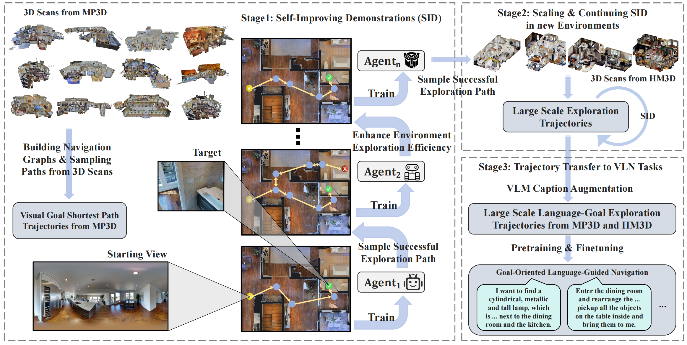

# Learning Goal-Oriented Language-Guided Navigation with Self-Improving Demonstrations at Scale

[](http://arxiv.org/abs/2509.24910)
[](https://huggingface.co/papers/2509.24910)

#### [Songze Li](https://scholar.google.com/citations?user=8rBMUD4AAAAJ), [Zun Wang](https://zunwang1.github.io/), [Gengze Zhou](https://gengzezhou.github.io/), [Jialu Li](https://jialuli-luka.github.io/), [Xiangyu Zeng](https://lanxingxuan.github.io/), [Limin Wang](https://wanglimin.github.io/), [Yu Qiao](https://scholar.google.com/citations?hl=en&user=gFtI-8QAAAAJ), [Qi Wu](http://www.qi-wu.me/), [Mohit Bansal](https://www.cs.unc.edu/~mbansal/), [Yi Wang](https://shepnerd.github.io/)



## 🏠 About

Goal-oriented language-guided navigation requires robust exploration capabilities for agents to navigate to specified goals in unknown environments without step-by-step instructions. Existing methods tend to exclusively utilize shortest-path trajectories, lacking effective exploration priors for prioritizing the success rate. To address the above challenges, we present SID, a goal-oriented language-guided navigation learning approach with Self-Improving Demonstrations. Specifically, SID learns an initial agent on the shortest-path data sampled from environments and then leverages this agent to generate novel exploration trajectories. The novel rollouts provide demonstrations with stronger exploration signals to train a better agent, which in turn produces higher-quality agent demonstrations for the next round of training. We show that this iterative self-improving pipeline readily scales to new environments, and the resulting demonstrations can be transferred across a variety of language-guided navigation tasks, elevating the performance ceiling in diverse goal-oriented navigation. Extensive experiments demonstrate that SID significantly boosts the exploration capabilities and generalization of navigation agents. The resulting agent achieves new state-of-the-art performance on goal-oriented language-guided navigation tasks, including REVERIE, SOON, notably achieving a 50.9% success rate on the unseen validation splits of SOON, surpassing the prior leading approaches by a margin of 13.9%.

## 📢 Update

[2025-09-30] We realease the [paper](http://arxiv.org/abs/2509.24910) for SID-VLN.

[2025-09-22] We realease the code and data for SID-VLN.

## 🛠 Getting Started

We test under the following environment:

* Python 3.8.10
* Pytorch 2.0.0
* CUDA Version 11.7

1. **Install Matterport3D simulators:** follow detailed instructions [here](https://github.com/peteanderson80/Matterport3DSimulator). We use the latest version instead of v0.1. Here is simplified instructions:

   ```bash
   git clone git@github.com:peteanderson80/Matterport3DSimulator.git
   git submodule update --init --recursive 
   sudo apt-get install libjsoncpp-dev libepoxy-dev libglm-dev libosmesa6 libosmesa6-dev libglew-dev libopencv-dev
   mkdir build && cd build
   cmake -DEGL_RENDERING=ON ..
   make -j8
   ```

   After successful installation, run:

   ```bash
   cp your_path/Matterport3DSimulator/build/MatterSim.cpython-38-x86_64-linux-gnu.so your_conda_path/envs/sidvln/lib/python3.8/MatterSim.cpython-38-x86_64-linux-gnu.so
   export PYTHONPATH=your_path/SIDVLN/mapnav:$PYTHONPATH
   export PYTHONPATH=your_path/Matterport3DSimulator/build:$PYTHONPATH
   ```

2. **Install requirements:**

   ```bash
   conda create --name sidvln python=3.8.10
   conda activate sidvln
   cd SID-VLN
   pip install -r requirements.txt
   ```

## 🏆 Model and Data

We release our final pretrained model and available data [here](https://huggingface.co/datasets/SongzeLi/SID-VLN/tree/main). Details:

**Connectivity:**

1. Connectivity of the navigation graphs.

**Data:**

1. `scan_round0_860scan.jsonl` – Image goal navigatoin trajectories in 800 HM3D environements.
2. `sid_lang_goal.jsonl` – Final detailed caption goal navigatoin trajectories for pretraining and REVERIE augmentation.
3. `img_goal_val*.json` – Image goal navigation validation seen and unseen splits.
4. `cap_goal_val*.json` – Caption goal navigation validation seen and unseen splits.
5. `scanvp_candview_relangles_with_hm3d_gibson.json` – Candidates related to scan and vp in HM3D environments.


**Features:**
1. `siglip_base.hdf5` – SigLIP features on MP3D and HM3D environments.  
2. `dinov2_base.hdf5` – DINOv2 features on MP3D and HM3D environments.  
3. `obj.avg.top3.min80_vit_base_patch16_224_imagenet.hdf5` – Object features for REVERIE.

**HM3D_cap:**

1. Generated detailed style captions for target images in HM3D and MP3D environments. 

**Model:**

1. `model_step_124000.pt` – The final pretrained model for downstream VLN finetuning.
2. `img_goal_best_val_unseen` – The image goal navigation agent which can be utilized to generate trajectories with high quality demonstrations on exploration strategies.
3. `model_LXRT.pth` – The pretrained LXMERT model for initialization DUET.

```
The data folder should follow this structure:

```shell
datasets/
├── ckpts/
    ├── model_LXRT.pth
    ├── img_goal_best_val_unseen
    ├── model_step_124000.pt   
|── REVERIE
│   ├── annotations/
│   	├── scan_round0_860scan.jsonl       
│     	├── sid_lang_goal.jsonl
│     	├── img_goal_val*.json
│     	├── cap_goal_val*.json
│     	└── scanvp_candview_relangles_with_hm3d_gibson.json  
│   ├── connectivity/
        ├── scanname_connectivity.json
        └── scans.txt
│   ├── features/
│   	├── siglip_base.hdf5        
│     	├── dinov2_base.hdf5
│     	└── obj.avg.top3.min80_vit_base_patch16_224_imagenet.hdf5     
├── SOON/
```

## 🚀 Training

1. **Multi-Round SID Pre-training**

   We use 8 NVIDIA A800 GPUs for pre-training agents on image goal navigation.

   ```bash
   cd pretrain
   bash run_img_goal.sh
   ```

2. **SID Fine-tunning & Trajectories Generating**

   We use 8 NVIDIA A800 GPUs for fine-tuning agents and generating trajectories for next-round training.

   ```bash
   cd mapnav
   bash scripts/run_img_goal.sh
   ```

3. **Langugae Goal Pre-training**

   We use 8 NVIDIA A800 GPUs for pre-training language goal navigation agents.

   ```bash
   bash run_lang_goal.sh
   ```

4. **Downstream VLN tasks Fine-tuning**

   We use one NVIDIA A800 GPU for finetuning our agent on downstream VLN tasks. Concrete config is presented in the scripts.

   ```bash
   bash run_lang_goal.sh
   ```

## 🙋‍♂️ Questions or Issues

 Please feel free to [open an issue](https://github.com/OpenGVLab/SID-VLN/issues) if you encounter any problems or have questions about SID-VLN.


## 🔗 Citation

If you find our work useful in your research, please consider starring 🌟 this repo and cite the following paper:

```bibtex
@article{li2025learning,
  title={Learning Goal-Oriented Language-Guided Navigation with Self-Improving Demonstrations at Scale},
  author={Li, Songze and Wang, Zun and Zhou, Gengze and Li, Jialu and Zeng, Xiangyu and Wang, Limin and Qiao, Yu and Wu, Qi and Bansal, Mohit and Wang, Yi},
  journal={arXiv preprint arXiv:2509.24910},
  year={2025}
}
```

## 👏 Acknowledgements


We thank the developers of [DUET](https://github.com/cshizhe/VLN-DUET), [SRDF](https://github.com/wz0919/VLN-SRDF), [InternVL](https://github.com/OpenGVLab/InternVL) for their public code release.


